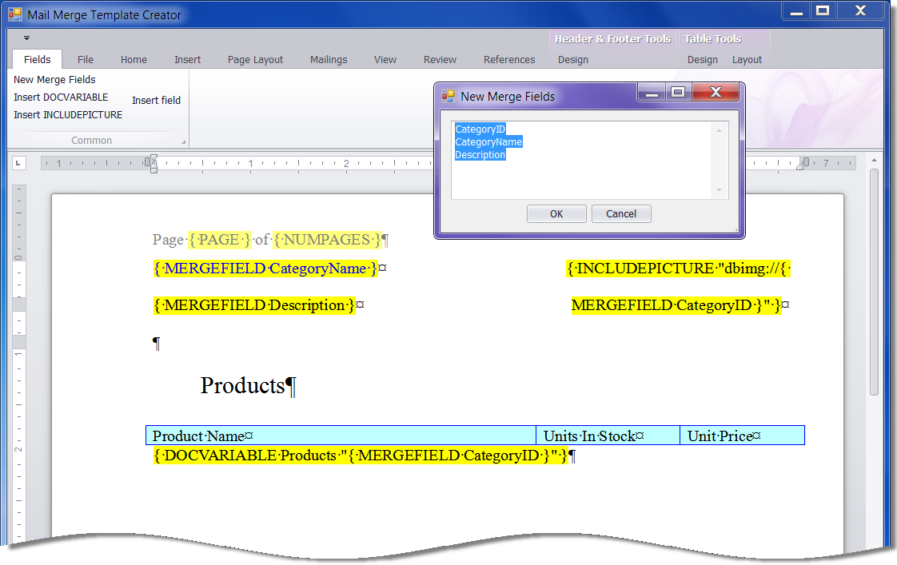

<!-- default badges list -->

<!-- default badges end -->

# Rich Text Editor for WinForms - Utility to Create a Mail Merge Template

This example project is a utility that allows you to simplify the mail merge template creation.

## Implementation Details

Invoke the **Fields | New Merge Fields** command to specify merge field names in the corresponding dialog. These names are used in code to create a fake data source and assign it to the [RichEditMailMergeOptions.DataSource](https://docs.devexpress.com/OfficeFileAPI/DevExpress.XtraRichEdit.RichEditMailMergeOptions.DataSource) property. After that, the **Mailings** ribbon page is activated and you can use the **Insert Merge Field** command to insert a field in the document.

In addition, the **Fields** ribbon page contains commands that allow you to insert [INCLUDEPICTURE](https://docs.devexpress.com/WindowsForms/9713/controls-and-libraries/rich-text-editor/fields/field-codes/includepicture) and [DOCVARIABLE](https://docs.devexpress.com/WindowsForms/9721/controls-and-libraries/rich-text-editor/fields/field-codes/docvariable) fields and an initial field pattern in the document. You can accomplish this manually by the CTRL+F9 key press.

You can save the document by the **File | Save** command and load in your application later as a mail merge template.

## Files to Review

* [Form1.cs](./CS/Form1.cs) (VB: [Form1.vb](./VB/Form1.vb))
* [NewFieldsForm.cs](./CS/NewFieldsForm.cs) (VB: [NewFieldsForm.vb](./VB/NewFieldsForm.vb))

## Documentation

* [Mail Merge in Rich Text Documents](https://docs.devexpress.com/WindowsForms/9330/controls-and-libraries/rich-text-editor/mail-merge)
* [Fields in Rich Text Documents](https://docs.devexpress.com/WindowsForms/11166/controls-and-libraries/rich-text-editor/fields)
